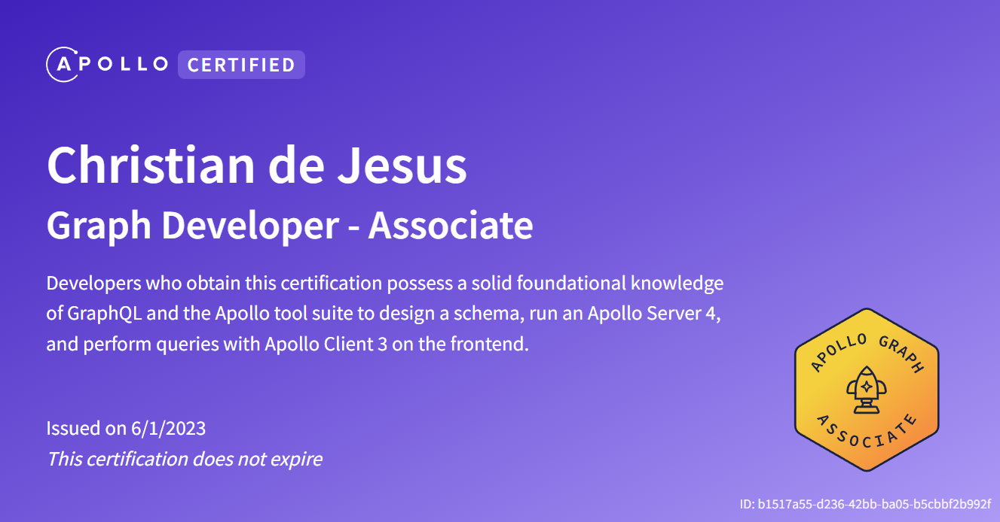

# graphql-demo

A repository containing all the code I used while learning GraphQL and Apollo Server.

## Certification

I received my Apollo GraphQL Associate Developer certification on June 1st, 2023.

## Todo

- Learn how to integrate it with a custom MongoDB REST API.
- Learn how to deploy it on the cloud and request data from it via a React client application.
